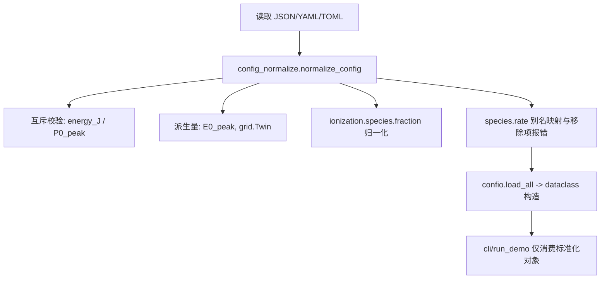

# Filament_python 运行与参数中文指南

> 适用目录：`Filament_python/`
> 
> 本指南覆盖：安装、运行、配置结构、诊断输出、以及**电离模型切换**（reference / LUT runtime / legacy）与 `time_mode` 的使用建议。

---

## 1. 项目简介

本项目用于高重频（kHz）激光空气成丝仿真，核心物理包括：

- 线性传播（`uppe` / `paraxial` / `bk_nee`）；
- 非线性（Kerr、自陡峭、拉曼、电离、等离子体折射与吸收）；
- 脉冲间慢时扩散（热/密度通道）。

推荐关注的诊断量：`I_max_z`、`U_z`、`rho_onaxis_max_z`、`w_mom_z`、`fwhm_plasma_z`、`fwhm_fluence_z`。

---

## 2. 环境安装

在仓库根目录执行：

```bash
pip install -r Filament_python/requirements.txt
```

GPU 运行需可用 CUDA + CuPy（环境变量控制见第 3 节）。

---

## 3. 快速运行

### 3.1 使用示例配置运行

```bash
python -m Filament_python.KHz_filament.cli Filament_python/config.json
```

### 3.2 GPU 运行

```bash
UPPE_USE_GPU=1 python -m Filament_python.KHz_filament.cli Filament_python/config.json
```

### 3.3 输出文件

程序会在配置中的输出路径（默认 `khzfil_out.npz`）写出时空坐标与诊断量。

### 3.4 仅预生成电离 LUT（推荐先跑一次）

当 `ionization.species[*].rate` 使用 `*_lut` 时，建议先执行：

```bash
python Filament_python/tools/build_ion_lut_cache.py --config Filament_python/config.json
```

这样可在传播前把表缓存到磁盘（默认 `cache/rate_tables`），后续参数不变时会直接复用，避免每次启动重建。

集群上可直接提交预置脚本（已提供）：

```bash
cd Filament_python
CFG=khz_config_lut.json sbatch sub_lut.sh
```

若出现如下报错（N50 分区常见）：

```text
N50区每卡默认分配 126GB 内存, 不允许超额申请内存
```

请**不要**在脚本里写 `#SBATCH --mem=...` / `--mem-per-cpu=...`；  
该分区按 GPU 卡数绑定内存，想要更多内存请提高 `--gres=gpu:N`。

---

## 4. 配置文件结构（`config.json`）

配置分为 7 大段：

- `grid`：空间/时间网格；
- `beam`：入射脉冲；
- `propagation`：传播器与自适应步长；
- `ionization`：电离模型与电子密度演化；
- `heat`：慢时热扩散；
- `run`：脉冲数；
- `raman`：拉曼模型与吸收。

### 4.1 配置标准化顺序图（加载时）

为减少“同一配置不同写法导致不同行为”的困惑，配置读取统一按以下顺序处理：



说明：`cli.py` 不再做额外兼容分支推断（例如旧键二次解释）；如有历史配置兼容逻辑，统一放在 `config_normalize.py`。

---

## 5. 电离模块完整说明（重点）

## 5.1 速率模型与分层架构

当前电离分为三层：

1. **reference evaluator（高精度、慢）**
   - `ppt_talebpour_i_full_reference`
   - `popruzhenko_atom_i_full_reference`
   - 用途：离线标定、单点检查、生成 LUT。

2. **runtime LUT evaluator（传播主循环默认推荐）**
   - `ppt_talebpour_i_lut`
   - `popruzhenko_atom_i_lut`
   - 用途：传播主循环中快速评估 `W(I)`，显著减少电离率计算耗时。

3. **legacy evaluator（回归/基线）**
   - `ppt_talebpour_i_legacy`
   - `popruzhenko_atom_i_legacy`（当前代码仍走原子 full 代理路径，主要用于兼容）

当前建议显式使用以下 `species[i].rate`（避免歧义）：

1. `ppt_talebpour_i_lut`（推荐）
   - Talebpour/PPT 分子分支（N2/O2 推荐，含 `Zeff`、`Ip_eV_eff` 等参数）；
   - 参考模型由 `reference_model: "ppt_talebpour_i_full_reference"` 指定；
   - O2 推荐 `Zeff=0.53` 与 `Ip_eV_eff=12.55`。

2. `popruzhenko_atom_i_lut`（推荐）
   - Popruzhenko 2008 arbitrary-gamma 原子/离子公式；
   - 参考模型由 `reference_model: "popruzhenko_atom_i_full_reference"` 指定；
   - 面向原子或离子（如 Xe 等）；用于 N2/O2 时属于 **atomic proxy**，不是分子严格模型。

3. `ppt_talebpour_i_legacy`
   - 旧版简化 PPT/ADK-like 近似，仅用于回归对照；
   - 不应再视为 Talebpour Appendix A 原式。

兼容别名：
- `ppt_talebpour_i` 会映射到 `ppt_talebpour_i_lut`（启动日志会提示）；
- `ppt_talebpour_i_full` 会映射到 `ppt_talebpour_i_full_reference`；
- `popruzhenko_atom_i` 会映射到 `popruzhenko_atom_i_lut`（启动日志会提示）；
- `popruzhenko_atom_i_full` 会映射到 `popruzhenko_atom_i_full_reference`。

> 已移除旧模型：`ppt_e` / `ppt_i_legacy`(`ppt_i`) / `adk_e` / `powerlaw`。若配置到这些值，程序会报错并提示迁移到保留模型。

---

## 5.2 `species` 常用字段

每个组分是一个对象：

- 通用字段：
  - `name`（如 `N2`/`O2`/`Xe`）
  - `rate`
  - `fraction`
  - `W_cap`（可选，覆盖全局上限）
  - `W_scale`（可选，数值缩放）

- `ppt_talebpour_i_lut` / `ppt_talebpour_i_full_reference` / `ppt_talebpour_i_legacy` 推荐字段：
  - `Ip_eV`
  - `Ip_eV_eff`（可选）
  - `Zeff`（推荐显式给出）
  - `l`, `m`
  - `max_terms`（reference 可选）
  - `sum_rel_tol`（reference 可选）
  - `reference_model`（当 rate 为 `*_lut` 时建议显式给出）

- `popruzhenko_atom_i_lut` / `popruzhenko_atom_i_full_reference` 推荐字段：
  - `Ip_eV`
  - `Z`
  - `l`, `m`
  - `max_terms`（可选，短程求和最大项数）
  - `sum_rel_tol`（可选，尾项收敛阈值）
  - `reference_model`（当 rate 为 `*_lut` 时建议显式给出）

## 5.3 `rate_table`（LUT 缓存）字段

推荐配置：

```json
"rate_table": {
  "enabled": true,
  "reuse_cache": true,
  "cache_dir": "cache/rate_tables",
  "rebuild_if_missing": true,
  "force_rebuild": false,
  "save_tables": true,
  "I_min_SI": 1e8,
  "I_max_SI": 1e19,
  "n_samples": 3000,
  "spacing": "log",
  "interp_mode": "loglog",
  "ref_cycle_avg_samples": 64,
  "popruzhenko_sum_tol": 1e-6,
  "popruzhenko_max_terms": 256
}
```

说明：
- 程序会按 species + 物理参数 + 网格参数 + 参考精度参数生成签名；
- 命中缓存时打印 `Loaded cached ionization LUT: ...`；
- 失配时打印字段不一致原因并重建。

## 5.4 时间模式与积分器

`ionization.time_mode`：

- `full`：全时域推进（推荐基准对比时使用）；
- `qs_peak`：准稳态，取脉冲时间峰值速率；
- `qs_mean`：准稳态，取时间平均速率；
- `qs_mean_esq`：准稳态，按 `E_rms`/`I_mean` 近似。

`ionization.integrator`：

- `rk4`（默认，`full` 下推荐）；
- `euler`（`full` 下可用于快速烟雾测试）。

`ionization.cycle_avg_samples`：

- 对 `*_i` 模型的周期平均生效，典型值 `32~128`，默认 `64`。

---

## 5.5 日志会打印哪些电离信息

程序启动后会逐组分打印：

- `rate alias`、`model family`；
- `Ip_eV`、`Ip_eV_eff`；
- `Z`、`Zeff`、`l,m`；
- `cycle_avg_samples`、`time_mode`、`integrator`。

并提供告警：

- N2/O2 使用 `popruzhenko_atom_i_lut` / `popruzhenko_atom_i_full_reference` 时会提示“atomic proxy，不是严格分子模型”；
- 使用 `ppt_talebpour_i_legacy` 时会提示“legacy 简化模型（非文献完整版）”；
- 使用旧别名时会提示实际映射到哪个 `*_lut` 或 `*_full_reference` 分支。

---

## 6. 常用配置示例

## 6.1 N2/O2（Talebpour）

```json
"ionization": {
  "species": [
    {
      "name": "N2",
      "rate": "ppt_talebpour_i_lut",
      "reference_model": "ppt_talebpour_i_full_reference",
      "Ip_eV": 15.6,
      "Zeff": 0.9,
      "l": 0,
      "m": 0,
      "fraction": 0.8
    },
    {
      "name": "O2",
      "rate": "ppt_talebpour_i_lut",
      "reference_model": "ppt_talebpour_i_full_reference",
      "Ip_eV": 12.1,
      "Ip_eV_eff": 12.55,
      "Zeff": 0.53,
      "l": 0,
      "m": 0,
      "fraction": 0.2
    }
  ],
  "time_mode": "full",
  "integrator": "rk4",
  "cycle_avg_samples": 16,
  "rate_table": {
    "enabled": true,
    "reuse_cache": true,
    "cache_dir": "cache/rate_tables",
    "force_rebuild": false,
    "I_min_SI": 1e8,
    "I_max_SI": 1e19,
    "n_samples": 3000,
    "spacing": "log",
    "interp_mode": "loglog",
    "ref_cycle_avg_samples": 64,
    "popruzhenko_sum_tol": 1e-6,
    "popruzhenko_max_terms": 256
  },
  "beta_rec": 0.0,
  "sigma_ib": 0.0,
  "I_cap": 1.0e19,
  "W_cap": 1.0e16
}
```

## 6.2 原子模型（Popruzhenko）

```json
"ionization": {
  "species": [
    {
      "name": "Xe",
      "rate": "popruzhenko_atom_i_lut",
      "reference_model": "popruzhenko_atom_i_full_reference",
      "Ip_eV": 12.13,
      "Z": 1,
      "l": 0,
      "m": 0,
      "max_terms": 4096,
      "sum_rel_tol": 1e-9,
      "fraction": 1.0
    }
  ],
  "time_mode": "full",
  "integrator": "rk4",
  "cycle_avg_samples": 16,
  "rate_table": {
    "enabled": true,
    "reuse_cache": true,
    "cache_dir": "cache/rate_tables",
    "force_rebuild": false,
    "I_min_SI": 1e8,
    "I_max_SI": 1e19,
    "n_samples": 3000,
    "spacing": "log",
    "interp_mode": "loglog",
    "ref_cycle_avg_samples": 64,
    "popruzhenko_sum_tol": 1e-6,
    "popruzhenko_max_terms": 256
  }
}
```

## 7. 40 fs benchmark 调参建议（电离相关）

如果出现“40 fs 峰值电子密度偏高”：

1. 固定时间模式做模型对照：
   - 先统一 `time_mode=full`, `integrator=rk4`；
   - 只切换 `rate`，避免“模型变化 + 时间近似变化”耦合。

3. 再比较 `full` vs `qs_mean`：
   - 用于评估时间近似误差，而不是替代模型验证。

4. 保持 `beta_rec=0`、`sigma_ib=0`（单脉冲基础 benchmark）
   - 先隔离电离率差异，再逐步打开其它等离子体机制。

---

## 8. 数值与结果 sanity 检查

建议每次改参数后至少检查：

- `U_z` 不应无故爆炸增长；
- `I_max_z` 不应出现相邻步极端跳变；
- `rho_onaxis_max_z` 不应长期超过空气中性粒子数量级上限；
- `w_mom_z` 应平滑演化，避免强锯齿；
- `fwhm_plasma_z`/`fwhm_fluence_z` 应连续且为正。

---

## 9. 最小自检命令（建议）

```bash
python -m compileall Filament_python/KHz_filament
pytest -q Filament_python/tests/test_sanity.py
PYTHONPATH=Filament_python python Filament_python/tests/ionization_selfcheck_min.py
```

---

## 10. 说明

- 旧版本中大量“参数解释文本”已从 `config.json` 移出，避免配置文件与文档重复、以及 JSON 解析问题；
- 详细说明以本 README 为准，`config.json` 保留可运行配置样例。

---

## 目录导航（补充）

```text
Filament_python/
├─ README.md
├─ KHz_filament/
│  ├─ README.md
│  └─ ionization/
│     └─ README.md
├─ tools/
│  └─ README.md
├─ tests/
│  └─ README.md
└─ matlab/
   └─ README.md
```

补充说明：
- 电离 LUT 相关工具统一放在 `tools/`。
- 各目录职责请优先查看对应 `README.md`。
- 项目参考文献统一位于仓库根目录的 `references/papers/`。
